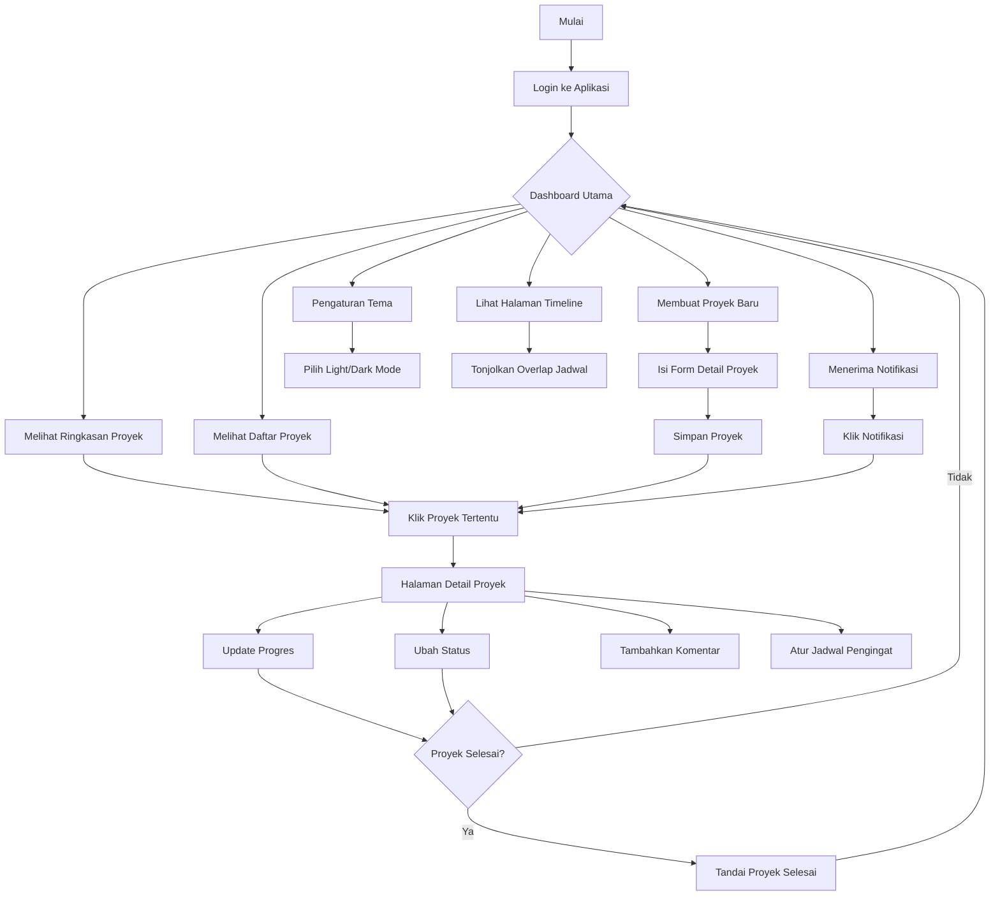
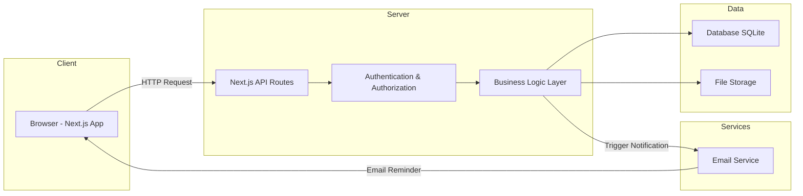
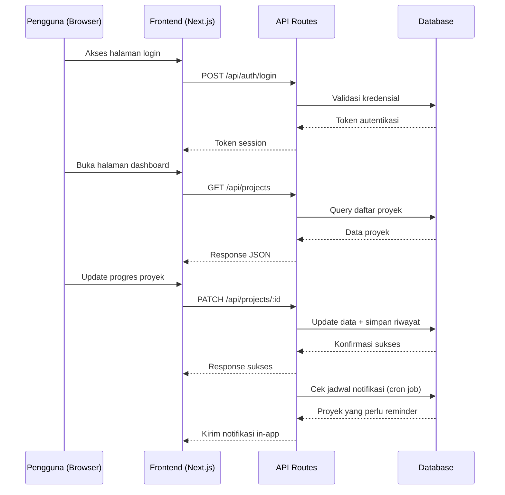

# PRD — Project Requirements Document

## 1. Overview

Divisi Enterprise Jaya Survei Indonesia (JSI) saat ini menghadapi kesulitan dalam memantau perkembangan proyek secara terpusat. Setiap anggota tim mengerjakan proyek yang berbeda, namun informasi status proyek tersebar di berbagai media (chat, email, spreadsheet) sehingga tidak ada satu sumber kebenaran yang jelas.

Aplikasi **Project Tracking Dashboard** hadir untuk menyelesaikan masalah ini dengan menyediakan platform terpusat yang memungkinkan setiap anggota divisi untuk:

- **Mencatat dan memperbarui progres** proyek masing-masing secara real-time
- **Melihat status proyek** seluruh tim dalam satu dashboard
- **Mengetahui prioritas** proyek mana yang harus dikerjakan lebih dulu
- **Menerima notifikasi otomatis** untuk proyek yang membutuhkan perhatian atau follow-up

Tujuan utamanya adalah meningkatkan transparansi, efisiensi koordinasi, dan memastikan proyek prioritas selalu mendapat perhatian yang tepat waktu.

---

## 2. Requirements

### Kebutuhan Fungsional

| Kode | Kebutuhan | Deskripsi |
|------|-----------|-----------|
| F1 | Halaman Login & Autentikasi | Pengguna dapat mengakses halaman login terdedikasi untuk masuk menggunakan email dan password dengan validasi kredensial serta mengakhiri sesi (logout) |
| F2 | Manajemen Profil | Pengguna dapat mengubah informasi profil (nama, foto, dll.) |
| F3 | CRUD Proyek | Pengguna dapat membuat, melihat, mengedit, dan menghapus proyek |
| F4 | Kategori Proyek | Proyek dapat dikategorikan: Penjualan, Jasa, Training, Riset |
| F5 | Level Prioritas | Setiap proyek memiliki prioritas: Tinggi, Sedang, Rendah. Secara default dihitung otomatis dari enam parameter berbobot yang disepakati tim (lihat §3a); bisa dikunci manual per proyek |
| F5b | Ketergantungan Proyek | Satu proyek dapat dicatat menahan proyek lain. Relasi ini menyumbang ke skor prioritas dan tidak boleh melingkar (dua proyek saling menunggu) |
| F6 | Status Proyek | Status mengikuti tahap pipeline: Prospect, Penawaran, Negosiasi, Berjalan, Tertunda, Selesai. Hanya "Selesai" yang dianggap terminal; "Tertunda" tetap dihitung aktif |
| F6b | Identitas & Nilai Klien | Setiap proyek mencatat instansi klien (wajib), nama PIC klien, email, telepon, dan Nilai Kontrak dalam rupiah penuh |
| F6c | Detail Kontrak & Keuangan | Setiap proyek mencatat nomor kontrak, tanggal kontrak, TOP (skema pembayaran: Full / 3 Termin / Custom beserta keterangannya), type tax (PKP / Non PKP), sales fee/kickback, dan cost operasional. Margin/profit **dihitung** dari kelima angka itu, tidak diketik dan tidak disimpan |
| F7 | Pelacakan Progres | Pengguna dapat memperbarui persentase progres dan menambahkan catatan |
| F8 | Riwayat Progres | Sistem mencatat riwayat perubahan progres setiap proyek |
| F9 | Dashboard Ringkasan | Tampilan ringkasan jumlah proyek per status dan prioritas |
| F10 | Filter & Pencarian | Pengguna dapat memfilter proyek berdasarkan status, prioritas, jenis, atau anggota |
| F11 | Notifikasi Pengingat | Pengguna menerima notifikasi untuk proyek yang perlu follow-up |
| F12 | Manajemen Jadwal Pengingat | Pengguna dapat mengatur waktu/jadwal pengingat untuk proyek tertentu |
| F13 | Kolaborasi Tim | Pengguna dapat melihat proyek milik anggota tim lain |
| F14 | Komentar Proyek | Pengguna dapat memberikan komentar/diskusi pada proyek tertentu |
| F15 | Halaman Profil Anggota | Menampilkan detail anggota tim dan daftar proyek yang sedang dikerjakan |
| F16 | Timeline & Alokasi Jadwal | Pengguna dapat melihat visualisasi timeline/Gantt chart proyek yang berjalan dalam rentang waktu yang sama untuk memetakan jadwal overlap dan membagi fokus serta alokasi tim lapangan secara optimal |
| F17 | Pengaturan Tema & Tampilan | Pengguna dapat memilih mode tampilan (Dark Mode / Light Mode) atau preferensi tema warna aksen antarmuka untuk kenyamanan visual, dan preferensi ini tersimpan di sistem/lokal |
| F19 | Tingkat Akses & Peran | Lima tingkat akses (Admin, Owner, HR, Manager, Anggota) di kolom `access_level`, terpisah dari `role` yang berisi jabatan bebas. Navigasi, halaman, dan tombol menyesuaikan peran; penegakannya di server, bukan sekadar menyembunyikan tombol |
| F20 | Kelola Pengguna | Admin dapat menambah akun beserta sandi awal, menyetel ulang sandi, mengubah tingkat akses, dan menonaktifkan akun. Menyetel sandi dan mengubah akses selalu mencabut sesi berjalan |
| F21 | Agenda Tim | Manager dan Anggota mencatat agenda (Lapangan/Kantor/Perjalanan/Cuti) berikut tanggal, lokasi, dan proyek terkait. Manager dapat mengisikan untuk anggotanya. Seluruh peran dapat melihatnya — inilah cara HR tahu siapa sedang di mana. Sejak F23 agenda menjadi sub-tab di menu "Rencana & Agenda" (`/rencana/agenda`); `/agenda` dialihkan permanen ke sana. Dua tampilan: petak Kalender (1 minggu sampai 1 tahun atau rentang bebas) dan Papan Tim per anggota (mingguan). Agenda bisa diseret dan dicentang untuk dihapus massal; form muncul sebagai popover saat agenda atau tanggal diklik (lihat 3f) |
| F22 | Laporan Mingguan | Ekspor Excel/Word/PDF berisi ringkasan pekan: proyek telat, tenggat 7 hari, selesai pekan ini, agenda tim, dan bentrok PIC. Terbuka untuk semua peran; kolom keuangan menyesuaikan hak masing-masing |
| F23 | Rencana Strategis | Divisi mencatat rencana yang belum berkontrak — pelatihan, riset, kemitraan — berikut langkah pelaksanaan, calon klien yang akan didekati, dan proyek nyata yang lahir darinya. Diklasifikasi dua sumbu: jenis kegiatan x tujuan strategis. Progres diturunkan dari langkah, tidak diketik. Semua peran melihat; Admin dan Manager menyusun; Owner tetap bisa berkomentar (lihat 3e) |
| F24 | Ringkasan Jangkauan | Tiap wilayah menampilkan jumlah proyek berjalan, rencana yang menyasar ke sana, dan calon klien. Wilayah yang sudah ada rencananya tapi belum ada proyeknya ditempatkan paling atas sebagai wilayah yang sedang dituju |
| F18 | Ekspor Data & Timeline | Daftar proyek dan timeline dapat diunduh sebagai Excel (.xlsx), Word (.docx), atau PDF. Ekspor mengikuti filter dan urutan yang sedang tampil di layar; nilainya tetap dibaca ulang di server sehingga berkas tidak pernah memuat angka yang sudah usang |

### Kebutuhan Non-Fungsional

| Kode | Kebutuhan | Deskripsi |
|------|-----------|-----------|
| NF1 | Keamanan | Data hanya dapat diakses oleh pengguna yang terautentikasi |
| NF2 | Responsivitas | Tampilan optimal di desktop, tablet, dan mobile |
| NF3 | Kinerja | Waktu muat halaman dashboard kurang dari 3 detik |
| NF4 | Reliabilitas | Data tidak hilang; backup terjadwal |
| NF5 | Kemudahan Penggunaan | UI sederhana dan intuitif tanpa perlu pelatihan khusus |

---

## 3. Core Features

### Fase 1 — Dashboard & Visibilitas Proyek

| Fitur | Deskripsi |
|-------|-----------|
| **Dashboard Utama** | Halaman ringkasan berisi total proyek, jumlah proyek berjalan, dan proyek selesai dalam satu tampilan |
| **Daftar Proyek** | Tabel/kartu berisi seluruh proyek yang dapat difilter berdasarkan status, prioritas, jenis, dan anggota |
| **Proyek Prioritas** | Proyek dengan prioritas tinggi otomatis disorot dan ditampilkan di bagian paling atas |
| **Timeline Proyek** | Tampilan timeline/Gantt interaktif berbasis rentang tanggal proyek untuk mendeteksi potensi tumpang tindih jadwal (overlapping projects), membutuhkan ketersediaan beban kerja, dan mempermudah distribusi personel/tim lapangan |

### Fase 2 — Manajemen Proyek & Pelacakan Progres

| Fitur | Deskripsi |
|-------|----------------|
| **Tambah Proyek Baru** | Form untuk membuat proyek dengan detail lengkap: nama, deskripsi, jenis, prioritas, tenggat waktu, dan PIC/penanggung jawab |
| **Edit & Hapus Proyek** | Pengguna dapat mengubah informasi proyek atau menghapus proyek yang sudah tidak relevan |
| **Atur Prioritas** | Prioritas dihitung otomatis dan diurutkan di bagian "Fokus Hari Ini"; PIC dapat mengunci nilainya secara manual bila ada pertimbangan khusus |
| **Kelola Jenis Proyek** | Mengatur kategori proyek: Penjualan, Jasa, Training, Riset |
| **Catat Progres** | Memperbarui persentase progres (0-100%) dan menambahkan catatan perkembangan |
| **Riwayat Progres** | Menampilkan log perubahan progres secara kronologis |
| **Ubah Status** | Mengubah tahap proyek: Prospect → Penawaran → Negosiasi → Berjalan → Selesai, dengan Tertunda untuk proyek yang diparkir sementara |

### Fase 3 — Notifikasi & Kolaborasi Tim

| Fitur | Deskripsi |
|-------|----------------|
| **Terima Notifikasi** | Notifikasi muncul untuk proyek yang mendekati tenggat, belum ada progres dalam waktu lama, atau baru ditugaskan |
| **Kirim Pengingat** | Sistem mengirim pengingat otomatis via email/in-app kepada PIC proyek |
| **Atur Jadwal Pengingat** | Pengguna dapat menentukan frekuensi dan waktu pengingat sesuai kebutuhan |
| **Lihat Proyek Anggota** | Menampilkan daftar proyek yang dikerjakan oleh setiap anggota tim |
| **Profil Anggota** | Halaman detail anggota berisi informasi kontak dan proyek yang sedang dikerjakan |
| **Komentar Proyek** | Fitur diskusi pada halaman detail proyek untuk koordinasi antar anggota |

### Fase 4 — Autentikasi & Manajemen Akun

| Fitur | Deskripsi |
|-------|-----------|
| **Halaman Login & Autentikasi** | Halaman login terdedikasi yang aman dengan validasi form, manajemen status sesi, dan proteksi rute halaman |
| **Tema & Kustomisasi Tampilan** | Pengaturan untuk beralih antara tema Terang (Light Mode) dan Gelap (Dark Mode) serta pemilihan palet warna aksen UI yang persisten |
| **Kelola Profil** | Pengguna dapat mengubah nama, foto profil, dan informasi kontak |

---

## 3a. Parameter Prioritas Proyek

Enam parameter hasil kesepakatan tim. Tiap parameter diberi skor **1-5**, lalu
dijumlahkan berbobot menjadi skor akhir **1,00-5,00**. Implementasinya di
`lib/priority.ts`, dan seluruh angka di bawah dikunci oleh `lib/priority.check.ts`.

| Parameter Prioritas | Bobot | Kriteria Skor 5 (Sangat Kritis) | Kriteria Skor 1 (Sangat Aman) |
|---|---|---|---|
| Nilai Proyek (Rp) | 25% | > Rp 500 Juta | < Rp 50 Juta |
| Status Mitra / Klien | 20% | Klien VIP / Tier 1 | Klien Baru / Proyek Internal |
| Risiko Penalti | 15% | Denda harian / Putus Kontrak | Tidak ada penalti |
| Progres Tertinggal | 15% | Tertinggal > 20 Poin | Mendahului Jadwal |
| Tenggat Waktu | 15% | < 7 Hari | > 30 Hari |
| Ketergantungan (Blocker) | 10% | Menahan > 2 Proyek Lain | Tidak berkaitan (Mandiri) |

**Band tengah.** Tabel di atas hanya mendefinisikan ujung-ujungnya; empat band di
antaranya diisi seperti ini:

| Skor | Nilai Proyek | Tenggat | Progres tertinggal | Ketergantungan |
|---|---|---|---|---|
| 5 | > Rp 500 jt | < 7 hari (termasuk lewat) | > 20 poin | menahan > 2 proyek |
| 4 | Rp 250-500 jt | 7-14 hari | 11-20 poin | menahan 2 proyek |
| 3 | Rp 100-250 jt | 15-21 hari | 1-10 poin | menahan 1 proyek |
| 2 | Rp 50-100 jt | 22-30 hari | tepat jadwal | menunggu proyek lain |
| 1 | < Rp 50 jt | > 30 hari | mendahului > 10 poin | mandiri |

Dua parameter memetakan langsung ke skor:

- **Status Mitra / Klien** — VIP 5 · Strategis 4 · Reguler 3 · Baru 2 · Internal 1
- **Risiko Penalti** — Putus kontrak 5 · Denda harian 5 · Denda tetap 4 · Teguran 2 · Tidak ada 1

**Ambang level:** skor >= 3,50 Tinggi · >= 2,50 Sedang · sisanya Rendah.

**Keputusan yang perlu dicatat:**

- Nilai proyek yang **belum diisi** diberi skor 3 (netral), bukan 1 — "belum
  ditentukan" tidak sama dengan "kecil".
- **Tenggat yang sudah lewat** masuk band 5 bersama "< 7 hari"; tabel tim tidak
  memberi band tersendiri untuk keterlambatan. Keterlambatan tetap menonjol lewat
  notifikasi dan parameter progres tertinggal.
- **Proyek Selesai** dikecualikan: skornya 1,00 dan levelnya Rendah.
- **Tahap pipeline** dan **bentrok jadwal PIC** tidak lagi menyumbang skor — keduanya
  di luar enam parameter — tapi tetap dipakai sebagai pemecah seri saat dua proyek
  skornya sama persis.
- **Data keuangan (F6c) sengaja tidak masuk skor.** Margin, sales fee, cost operasional,
  dan status pajak ditampilkan untuk dibaca orang, tapi tidak menggeser urutan.
  Parameter "Nilai Proyek" tetap diukur dari Nilai Kontrak bruto sesuai kesepakatan.
  Kalau suatu saat tim ingin prioritas digerakkan margin, itu keputusan tim — bukan
  perubahan yang boleh masuk diam-diam lewat penambahan kolom.

---

## 3b. Ekspor Berkas

Tiga format, empat cakupan (daftar proyek, timeline, laporan mingguan, dan rencana strategis). Berkasnya dibuat di server
lewat **server action**, bukan route handler — alasannya sama dengan `lib/actions.ts`:
route handler punya salinan modul sendiri, jadi berkas yang dibuat di sana akan
memuat data awal, bukan perubahan yang baru disimpan orang lewat form. Ekspor yang
diam-diam basi lebih berbahaya daripada ekspor yang gagal.

| Format | Daftar Proyek | Timeline | Rencana Strategis |
|---|---|---|---|
| Excel (.xlsx) | Seluruh kolom, angka sebagai angka, baris kepala dibekukan | 3 lembar: jadwal, bentrok jadwal, bentrok PIC | 4 lembar: Rencana, Langkah, Prospek, Jangkauan |
| Word (.docx) | Tabel kolom inti, halaman bentang | Tabel jadwal + rincian bentrok | Tabel rencana + bagian Langkah, Prospek, Jangkauan |
| PDF | Tabel kolom inti, berhalaman, kepala tabel diulang | **Gantt chart** dengan penanda bulan dan legenda prioritas | Satu tabel bergabung dengan kolom penanda bagian |

**Yang perlu dicatat:**

- **Satu definisi kolom** di `lib/export/dataset.ts` dipakai ketiga format, jadi
  Excel, Word, dan PDF tidak bisa menyajikan angka berbeda untuk proyek yang sama.
  Yang boleh berbeda hanya kolom mana yang dipakai — lembar kerja muat memuat
  semuanya, halaman A4 tidak.
- **Excel menerima angka mentah**, bukan teks berformat. Orang membuka spreadsheet
  justru untuk menjumlah dan membuat pivot; "Rp 505.000.000" sebagai teks
  membatalkan semua itu.
- **Tanggal ditulis ISO** (`YYYY-MM-DD`), bukan `Date` Excel. Mengubahnya jadi
  tanggal sungguhan berarti menyerahkan penafsiran zona waktu ke Excel, dan
  tanggal kontrak yang bergeser sehari jauh lebih merugikan daripada kolom yang
  tidak bisa difilter sebagai tanggal. ISO tetap terurut benar secara teks.
- **Gantt di PDF memakai `barPosition()` dan `monthTicks()` yang sama dengan layar**,
  sehingga grafik cetak tidak bisa bergeser dari grafik di aplikasi.
- Font standar PDF hanya mengenal WinAnsi. Nama proyek datang dari isian orang,
  jadi teksnya dijinakkan lebih dulu (`aman()`) — berkas dengan satu tanda tanya
  jauh lebih baik daripada ekspor yang gagal total.
- **Ekspor rencana tidak punya kolom keuangan sama sekali**, jadi penyaringan
  `lihat-keuangan` memang tidak berlaku di sana. Itu keputusan, bukan kelalaian,
  jadi dikunci satu assertion di `lib/export.check.ts`.
- Ekspor **mengikuti filter di layar** lewat daftar id, tapi nilainya dibaca ulang
  di server. Kolom yang disembunyikan di tabel **tetap ikut** ke Excel: menyembunyikan
  kolom itu soal ruang layar, bukan soal apa yang mau dibawa keluar.

Pustaka: `write-excel-file` (xlsx), `docx`, `pdf-lib`. Ketiganya murni JavaScript
tanpa dependensi native.

---

## 3c. Matriks Tingkat Akses

Tingkat akses disimpan di kolom `access_level`, **terpisah** dari `role` yang berisi
jabatan bebas ("Project Manager"). Kalau keduanya satu kolom, mengganti jabatan
seseorang akan diam-diam mengganti haknya juga.

| Kemampuan | Admin | Owner | HR | Manager | Anggota |
|---|---|---|---|---|---|
| Daftar proyek + timeline | ✅ | ✅ | ✅ | ✅ | ✅ |
| Overview, detail proyek, tim, notifikasi | ✅ | ✅ | ❌ | ✅ | ✅ |
| Angka keuangan (margin, fee, cost, DPP) | ✅ | ✅ | ❌ | ✅ | ❌ |
| Komentar + kirim pengingat | ✅ | ✅ | ❌ | ✅ | ✅ |
| Ubah proyek apa pun | ✅ | ❌ | ❌ | ✅ | ❌ |
| Ubah proyek yang dipegang sendiri | ✅ | ❌ | ❌ | ✅ | ✅ |
| Buat / hapus proyek, kelola jenis | ✅ | ❌ | ❌ | ✅ | ❌ |
| Kelola pengguna | ✅ | ❌ | ❌ | ❌ | ❌ |
| Ekspor + laporan mingguan | ✅ | ✅ | ✅ | ✅ | ✅ |
| Lihat agenda semua orang | ✅ | ✅ | ✅ | ✅ | ✅ |
| Isi agenda sendiri | ✅ | ❌ | ❌ | ✅ | ✅ |
| Isi agenda orang lain | ✅ | ❌ | ❌ | ✅ | ❌ |
| Lihat rencana strategis | ✅ | ✅ | ✅ | ✅ | ✅ |
| Susun / ubah rencana strategis | ✅ | ❌ | ❌ | ✅ | ❌ |

Matriksnya ditulis sekali sebagai fungsi murni di `lib/permissions.ts` dan dikunci
`lib/permissions.check.ts`.

**Penegakan berlapis, dan yang sungguhan ada di server:**

1. **Middleware** — hanya memeriksa bentuk cookie (Edge runtime, tidak bisa baca data).
2. **Halaman** — `requireAbility()` mengalihkan ke halaman yang memang boleh dibuka
   peran itu, bukan menampilkan halaman kosong. HR mendarat di `/proyek`.
3. **Server action** — penjaga sesungguhnya. Menyembunyikan tombol bukan kontrol
   keamanan; server action bisa dipanggil langsung.
4. **Route handler** — sesi + kemampuan di 21 dari 23 endpoint (dua sisanya login
   dan logout, yang memang publik).

**Penyensoran keuangan membuang kolomnya, bukan menimpa nilainya dengan `null`.**
Di sistem ini `null` sudah berarti "belum diisi", jadi menimpanya akan berbohong soal
kelengkapan data. Kolomnya dibuang sebelum berkas ekspor dibentuk dan kuncinya dihapus
dari balasan JSON.

**Catatan soal sesi:** sesi disimpan di tabel `sessions`, bukan di memori. Karena
route handler dan halaman sama-sama membaca file database yang sama, sesi dari form
login berlaku juga untuk endpoint REST dan sebaliknya — pemisahan yang dulu ada sudah
tidak berlaku. Sesi juga bertahan saat server dimulai ulang.

---

## 3d. Penyimpanan Data

Seluruh data aplikasi tersimpan di SQLite (`data/dashboard.db`) lewat `node:sqlite`
bawaan Node — tanpa dependensi tambahan.

**Pembagian tanggung jawab:**

| Lapis | Berkas | Isinya |
|---|---|---|
| SQL | `lib/db/store.ts` | Satu-satunya tempat query berjalan saat aplikasi dipakai. Penerjemahan snake_case ⇄ camelCase terkumpul di sini. |
| Aturan bisnis | `lib/api.ts` | Menyusun bentuk yang dipakai layar: prioritas diterapkan, relasi dilengkapi, angka diringkas. |
| Skema | `lib/db/migrations.ts` | 14 migrasi, tidak pernah disunting setelah dirilis. |

**`lib/mock-data.ts` sekarang hanya sumber seed**, bukan sumber data. Aplikasi tidak
pernah membacanya saat berjalan.

**Seed hanya mengisi database yang masih kosong.** Ini penting: database memuat data
kerja yang sesungguhnya — sandi yang disetel admin, proyek yang disunting, agenda yang
diisi orang. Kalau seed tetap memakai upsert seperti dulu, setiap `npx tsx lib/db/setup.ts`
akan mengembalikan semuanya ke isi mock-data. Untuk sengaja membangun ulang data contoh:
`npx tsx lib/db/setup.ts --force`.

**Berkas check tidak menyentuh database nyata.** `lib/api.check.ts` dan
`lib/session.check.ts` menyiapkan database di memori sendiri lewat `useDb()` di
`lib/db/index.ts` — jahitan uji yang sengaja dibuat terlihat, bukan env yang dibaca
diam-diam.

---

## 3e. Rencana Strategis

Dashboard ini semula hanya melacak **pekerjaan yang sudah berjalan**. Dua hal yang
menentukan pendapatan tahun depan tidak punya tempat: ke mana divisi menuju, dan
pasar mana yang akan didekati. Keduanya hidup di kepala orang, dan sebagiannya
setengah tercatat sebagai proyek (`Riset Carbon Stock`, `MOU ITERA`) sehingga niat
dan pelaksanaannya tercampur di satu tempat yang bentuknya tidak cocok untuk keduanya.

**Contoh nyata yang jadi acuan rancangan:**

1. **Pelatihan Inspektur Tambang** — Pelatihan → Penetrasi Pasar. Tidak ada klien
   yang membayar, tapi memperkenalkan metode kami kepada pihak yang menilai kepatuhan
   perusahaan tambang.
2. **Riset Arkeologi & Carbon Stock** — Riset → Kesiapan Regulasi. Aturan pemerintah
   belum terbit; menyiapkan metodenya sekarang berarti begitu aturan keluar divisi
   sudah punya rujukan, bukan baru mulai belajar.

### Dua sumbu klasifikasi

Satu sumbu tidak cukup: "Pelatihan" tidak memberi tahu untuk apa, dan "Penetrasi Pasar"
tidak memberi tahu caranya. Jadi keduanya dicatat terpisah.

| Sumbu | Nilai |
|---|---|
| Jenis kegiatan (`kind`) | Pelatihan, Riset, Kemitraan, Sertifikasi, Pemasaran |
| Tujuan strategis (`goal`) | Penetrasi Pasar, Kesiapan Regulasi, Kapasitas Internal, Efisiensi Biaya |

Daftar rencana dikelompokkan menurut **tujuan** — itu pertanyaan yang paling sering
diajukan ke halaman ini.

### Sasaran pasar

Sasaran dicatat sebagai **segmen + wilayah + daftar calon klien**. Segmen tertutup
(Tambang, Perkebunan, Kehutanan, Infrastruktur, Energi, Instansi Pemerintah, Akademik,
Lainnya) supaya bisa disaring dan dijumlah; wilayah teks bebas supaya sebangun dengan
`location_province` di `projects`.

Calon klien punya corongnya sendiri (Belum dihubungi → Dihubungi → Presentasi →
Negosiasi → Menjadi Klien / Tidak Lanjut), **terpisah** dari pipeline proyek: yang
tercatat di sini belum tentu pernah jadi proyek, dan itu justru gunanya — pendekatan
bisa dipantau satu per satu, bukan cuma diniatkan.

### Ringkasan jangkauan

Tiap wilayah dihitung tiga angka: proyek yang sudah berjalan di sana, rencana yang
menyasar ke sana, dan calon klien di sana. Wilayah yang **ada rencananya tapi belum
ada proyeknya** diurutkan paling atas — itulah wilayah yang sedang dituju, dan itulah
alasan ringkasan ini ada.

**Wilayah dicocokkan apa adanya** (setelah dipangkas dan disamakan huruf besar-kecilnya),
tanpa pencocokan kira-kira. Jadi "Kepri" dan "Kepulauan Riau" tampil sebagai dua baris.
Itu masalah keseragaman pengisian yang perlu **terlihat**, bukan disembunyikan
penggabungan otomatis yang bisa saja salah.

### Progres dihitung, tidak diketik

Progres rencana diturunkan dari langkah-langkahnya, dengan alasan yang sama seperti
margin di `lib/finance.ts`: angka yang disimpan akan melenceng dari langkahnya begitu
salah satunya berubah. Langkah berstatus `Batal` tidak dihitung sebagai selesai
**maupun** sebagai penyebut — membatalkan langkah bukan kegagalan, jadi tidak boleh
menyeret persentasenya turun.

Nomor urut (`sort_order`) adalah kunci pengurutan, bukan nomor yang ditampilkan; nomor
di layar dan di laporan dihitung dari posisinya, sehingga tetap rapat walau ada langkah
yang dihapus di tengah.

### Kaitan rencana ↔ proyek

Satu rencana bisa melahirkan beberapa proyek, dan satu proyek bisa melayani lebih dari
satu rencana. Menghapus proyek **hanya memutus kaitannya** — rencananya tetap ada,
sehingga arah divisi tidak ikut hilang saat daftar proyek dirapikan.

### Agenda digabung

Agenda Tim dan Rencana Strategis kini satu menu dengan dua sub-tab, karena keduanya
menjawab pertanyaan yang bersebelahan: ke mana kita menuju, dan siapa sedang di mana
untuk menjalankannya. Datanya tetap terpisah; yang disatukan pintu masuknya.

| Rute | Isi | Penjaga |
|---|---|---|
| `/rencana` | Daftar rencana + ringkasan jangkauan | `lihat-rencana` |
| `/rencana/baru`, `/rencana/[id]/ubah` | Formulir rencana | `kelola-rencana` |
| `/rencana/[id]` | Detail: langkah, prospek, proyek terkait, diskusi | `lihat-rencana` |
| `/rencana/agenda` | Agenda Tim (pindahan dari `/agenda`) | `lihat-agenda` |

`/agenda` dialihkan permanen (308) ke `/rencana/agenda`, supaya tautan dan penanda
lama tidak mati.

### Hak akses

| Kemampuan | Admin | Owner | HR | Manager | Anggota |
|---|---|---|---|---|---|
| `lihat-rencana` | ✅ | ✅ | ✅ | ✅ | ✅ |
| `kelola-rencana` | ✅ | ❌ | ❌ | ✅ | ❌ |

Komentar memakai `kolaborasi` yang sudah ada: Owner bisa menanggapi tanpa bisa
mengubah, HR hanya membaca. Penegakannya di server action, bukan di tombol — sudah
dibuktikan dengan memanggil `simpanRencana` dan `ubahStatusLangkah` langsung lewat
HTTP sebagai Owner, HR, dan Anggota; ketiganya ditolak dan tidak ada satu baris pun
yang tersimpan.

### Ekspor

Jenis ekspor tersendiri (`scope: "rencana"`), memakai ketiga perender Excel/Word/PDF
yang sudah ada. Excel mendapat empat lembar: **Rencana**, **Langkah**, **Prospek**,
dan **Jangkauan**. Tidak ada kolom keuangan sama sekali di ekspor ini, jadi penyaringan
`lihat-keuangan` memang tidak berlaku — ditulis eksplisit di kode dan dikunci satu
assertion supaya tidak terbaca sebagai kelalaian.

---

## 3f. Papan Agenda

Papan agenda menggambar **satu bar memanjang per orang per proyek**, bukan satu
kotak per hari. Sebelumnya agenda Senin-Rabu tampil sebagai tiga kotak yang
bunyinya sama persis, dan tiga entri terpisah di proyek yang sama jadi sembilan
kotak — papan yang seharusnya menjawab "siapa sedang di mana" penuh pengulangan.

**Yang digabung hanya tampilannya.** Baris di `agenda` tidak pernah disatukan,
jadi keputusan ini bisa dibalik tanpa kehilangan catatan per entri. Hitungannya
di `lib/agenda.ts` (`mergeBars`, `assignLanes`, `weekBars`, `barSpan`), seluruhnya
fungsi murni yang teruji tanpa DOM.

**Kunci pengelompokan: orang + proyek + jenis kegiatan.**

- `kind` ikut jadi kunci karena warna dan label bar **adalah** jenis kegiatannya.
  Perjalanan dan Lapangan di proyek yang sama tetap dua bar; bar campuran tidak
  punya warna yang jujur dan legenda jenis di atas papan jadi berbohong.
- Entri **tanpa proyek** dikelompokkan per jenis saja — tidak ada proyek yang bisa
  "sama", tapi dua blok Kantor berdampingan tetap layak menyatu.

**Hanya yang bersambung yang menyatu.** Senin-Selasa dan Jumat di proyek yang sama
tetap dua bar. Meleburnya jadi satu bar Senin-Jumat akan mengklaim orangnya ada di
proyek itu Rabu-Kamis padahal tidak, dan papan ini dibaca HR untuk tahu siapa
sedang di mana — kerapian tidak boleh dibayar dengan kebohongan.

**Penggabungan dihitung dari seluruh entri, bukan hanya yang sepekan,** lalu bar
yang menyentuh pekan itu yang ditampilkan; kalau dipotong lebih dulu, agenda yang
membentang melewati batas pekan akan pecah jadi dua bar di dua pekan bersebelahan.

**Bar yang isinya beririsan ditandai `bertumpuk`** — itu data ganda milik orang
yang sama, bukan orang di dua tempat. Barnya menyatu supaya papan bersih, tapi
penandanya tetap ada supaya sinyalnya tidak hilang.

### Periode tampilan

Papan tidak terkunci sepekan. Enam pilihan: **1 Minggu, 2 Minggu, 1 Bulan,
3 Bulan, 1 Tahun**, dan **rentang khusus** dengan dua kolom tanggal bebas.

**Semua preset disejajarkan kalender**, bukan "N hari dari hari ini": "1 Bulan"
berarti September penuh, jadi "Berikutnya" berarti Oktober dan bukan mendarat di
tengah bulan. Satu geseran memindahkan tepat satu satuan skalanya, dan periode
berikutnya selalu mulai persis sehari setelah yang sekarang berakhir — tidak ada
tumpang tindih maupun lubang.

| Skala | Rentang |
|---|---|
| 1 Minggu | Senin–Minggu, memakai `weekRange()` yang sudah ada |
| 2 Minggu | Senin, 14 hari |
| 1 Bulan | tanggal 1 s/d hari terakhir bulan (29 di Februari kabisat) |
| 3 Bulan | awal bulan acuan s/d akhir bulan ketiga |
| 1 Tahun | 1 Januari s/d 31 Desember |
| Khusus | apa adanya; tanggal akhir yang mendahului awalnya dijepit jadi sehari |

**Bentuk papan diturunkan dari PANJANG rentang, bukan dari tombol yang ditekan.**
Kalau diikat ke preset, rentang khusus dua tahun akan dipaksa muat layar dan jadi
tidak terbaca. Ambangnya satu tempat, `AMBANG_TITIK = 120` hari:

| Panjang rentang | Kepala kolom | Bentuk agenda | Lebar papan |
|---|---|---|---|
| ≤ 14 hari | per hari ("Sen 31/8") | bar berdurasi | muat layar |
| 15–120 hari | per pekan ("31/8") | bar berdurasi | muat layar |
| > 120 hari | per bulan ("Sep 26") | **titik berwarna** | menggulir, min. 4px/hari |

Jadi 3 Bulan (91 hari) masih bar, sedangkan 1 Tahun dan rentang khusus yang
panjang jatuh ke mode titik. Rentang khusus sepuluh hari tetap berlabel harian
sama seperti tampilan sepekan — itulah gunanya ambang diturunkan dari rentangnya.

**Mode titik**: satu titik = satu agenda, diletakkan di tanggal mulainya, diwarnai
menurut jenis kegiatan. Di rentang sepanjang itu satu hari hanya beberapa piksel,
jadi bar berdurasi tidak lagi membawa informasi yang bisa dibaca — dan **seret
dimatikan**, karena satu piksel meleset berarti beberapa hari meleset. Yang tetap
jalan: klik untuk membuka, `Enter`, `Spasi` untuk mencentang, dan hapus massal.
**Pencentangan lewat `Spasi`, bukan kotak centang** — kotak centang tidak muat di
dalam titik 10px, dan inilah yang dibayar padanan papan ketik sejak awal.

### Dua tampilan

Papan agenda punya dua bentuk karena ia menjawab dua pertanyaan yang berbeda,
dan satu tata letak tidak bisa menjawab keduanya dengan baik.

| Tampilan | Menjawab | Bentuk | Periode |
|---|---|---|---|
| **Kalender** (bawaan) | "apa yang terjadi kapan" | petak pekan, 7 kolom hari | 1 minggu – 1 tahun, atau rentang bebas |
| **Papan Tim** | "siapa sedang di mana" | satu baris per anggota | **mingguan saja** |

Papan Tim sengaja dikunci mingguan: hanya di rentang sependek itu bar per orang
masih cukup lega untuk dibaca. Di rentang sebulan, bar per anggota menyusut jadi
potongan yang labelnya terpotong — persis keluhan yang melahirkan tampilan
kalender.

### Petak kalender

Baris = pekan, kolom = tujuh hari, seperti kalender pada umumnya. **Tiap baris
pekan itu sendiri sebuah `RentangAgenda` tujuh hari**, jadi `barSpan()` yang
sudah ada langsung menempatkan chip di dalamnya lengkap dengan pemotongan di
kedua ujungnya — agenda yang melewati batas pekan otomatis terbelah jadi dua
segmen bersambung, tanpa kode pemotongan tersendiri.

Baris pekan sengaja melebar ke luar rentang (Senin sebelum tanggal 1, Minggu
sesudah tanggal terakhir). Petak yang barisnya tidak utuh akan membuat kolom
hari tidak sejajar dari baris ke baris; hari tetangga itu diredupkan lewat
`diLuarRentang()`.

Karena barisnya tanggal dan bukan orang, **nama anggota pindah ke dalam chip**
("Harir · Lapangan · Riset Carbon Stock"). Sel yang chipnya lebih dari tiga
jalur menampilkan "+N lainnya" yang membuka sisanya, meniru kalender umum.

**Tampilan 1 tahun berganti bentuk**: lima puluh tiga baris pekan tidak bisa
dibaca sebagai satu tampilan, jadi setahun digambar sebagai dua belas petak
bulan kecil dengan **titik berwarna** menurut jenis kegiatan. Ambangnya tetap
`AMBANG_TITIK`, dan tetap diturunkan dari panjang rentang — rentang khusus dua
tahun pun jatuh ke bentuk yang sama.

### Form sebagai popover

Form tidak lagi menempel di bawah halaman. Ia muncul **hanya ketika ada yang
diklik**, menempel pada apa yang diklik:

| Yang diklik | Yang muncul |
|---|---|
| Tanggal kosong | Form agenda baru, tanggalnya sudah terisi |
| Agenda berisi satu entri | Form ubah, langsung terisi |
| Agenda gabungan | Daftar entri di dalamnya, masing-masing dengan tombol Ubah |
| Tombol "+ Isi" di Papan Tim | Form agenda baru untuk anggota itu |

Popover menjepit dirinya ke tepi layar dan membalik ke atas kalau tidak muat di
bawah — popover yang separuh keluar layar sama saja dengan tidak muncul. Ditutup
dengan `Esc` atau klik di luar. Lapisan penangkap kliknya **tidak digelapkan**:
popover menempel pada tanggalnya, dan tanggal itu harus tetap terlihat.

### Seret-lepas

Ditulis dengan **Pointer Events**, bukan HTML5 drag-and-drop: satu API untuk
tetikus, pena, dan sentuh, dan hanya itu yang bisa dipakai untuk gagang
ubah-durasi. Tidak ada pustaka baru — proyek ini tetap tanpa dependensi UI.

| Gerakan | Akibat |
|---|---|
| Seret chip/bar | Seluruh entri di dalamnya bergeser sejauh hari yang sama |
| Seret bar ke baris lain (**Papan Tim**) | Seluruh entri berpindah pemilik |
| Tarik gagang ujung | Mengubah durasi **entri di ujung itu saja** |
| Klik (seretan nol) | Membuka popover: form kalau satu entri, daftar kalau gabungan |

Di petak kalender tidak ada baris anggota untuk dijatuhi, jadi **memindahkan
agenda ke orang lain hanya lewat form**; di Papan Tim, menyeret ke baris lain
tetap bisa.

**Sasaran seretan dihitung dari sel yang sedang ditunjuk pointer**, bukan dari
selisih piksel dibagi lebar kolom. Di petak kalender satu langkah ke bawah
berarti tujuh hari, dan aritmetika piksel akan meleset begitu tinggi baris tidak
seragam.

**Kehalusan seretan** datang dari dua hal: `pointermove` diredam ke satu frame
lewat `requestAnimationFrame` — tanpa itu tiap kejadian memicu render dan
seretan justru tersendat — dan chip diberi transisi posisi pendek sehingga tiap
loncatan ke sel berikutnya meluncur, bukan berkedip.

**Ubah durasi tidak pernah bisa menghapus entri.** Gagang kanan menggeser
`endDate` entri terakhir, gagang kiri menggeser `startDate` entri pertama, dan
keduanya dijepit `clampResize()` supaya tidak melewati entri itu sendiri.
Gagang disembunyikan di sisi yang terpotong batas pekan: tepi yang terlihat di
sana adalah batas pekan, bukan ujung agendanya.

**Padanan papan ketik wajib, bukan tambahan.** `←/→` geser sehari, `Shift+←/→`
ubah durasi, `Alt+↑/↓` pindah anggota, `Spasi` centang, `Enter` buka. Hasil tiap
gerakan diumumkan lewat `aria-live`; tanpa itu fitur ini hanya bisa dipakai orang
yang memakai tetikus.

**Di ponsel tidak ada seret** — bar selebar layar HP lebih sering meleset daripada
kena. Kartu per anggota tetap, bar gabungan jadi satu kartu, dan menggeser tanggal
di sana tetap lewat form.

### Hapus massal

Kotak centang hanya dirender pada bar yang **seluruh isinya** boleh diubah
pemakainya, dan mencentang bar mengambil seluruh entri di dalamnya. Bilah
seleksi menyebut jumlah **entri**, bukan jumlah bar, supaya jelas berapa baris
yang sebenarnya hilang.

`hapusAgendaBanyak()` **menolak seluruh batch** kalau ada satu saja di luar hak
pemakainya, dan menyebut berapa yang ditolak. Menghapus sebagian lalu diam akan
membuat orang mengira pilihannya sudah bersih padahal belum.

### Penegakan

Ketiga server action (`geserAgenda`, `ubahRentangAgenda`, `hapusAgendaBanyak`)
memakai penjaga yang sama dengan jalur form — menyeret bar bukan cara lain untuk
mengubah agenda, hanya cara lain untuk memintanya.

- **Klien hanya mengirim selisih hari, bukan tanggal jadi.** Tanggal barunya
  dihitung server dari nilai tersimpan, sehingga tab yang lama terbuka tidak bisa
  menuliskan hasil hitungan yang sudah usang. Selisihnya dibatasi ±370 hari.
- **Penjaga dua sisi**: `canEditAgenda()` diperiksa untuk setiap entri yang
  digeser **dan** untuk pemilik barunya. Tanpa pemeriksaan kedua, seseorang bisa
  menyeret agendanya sendiri ke nama orang lain.
- `ubahRentangAgenda()` diteruskan ke `perbaruiAgenda()` supaya aturan tanggal
  tidak bercabang dari form.
- Pemindahan dan penghapusan massal berjalan dalam **satu transaksi**
  (`agenda.moveMany`, `agenda.removeMany`): gagal di tengah akan meninggalkan bar
  terbelah dua tanggal — keadaan yang tidak bisa dibentuk lewat UI mana pun.

---

## 4. User Flow

### Alur Utama Pengguna (Anggota Divisi Enterprise)



### Detail Langkah Pengguna

1. **Login** — Pengguna masuk menggunakan akun email & password yang terdaftar pada halaman login khusus.
2. **Lihat Dashboard** — Pengguna melihat ringkasan total proyek, proyek berjalan, proyek selesai, dan proyek prioritas tinggi.
3. **Eksplorasi Proyek** — Pengguna dapat memfilter daftar proyek berdasarkan status, prioritas, atau jenis.
4. **Buat Proyek** — Klik tombol "Tambah Proyek", isi form lengkap, lalu simpan.
5. **Update Progres** — Buka detail proyek, perbarui persentase progres, dan tambahkan catatan.
6. **Ubah Status** — Tandai proyek selesai jika pekerjaan telah rampung.
7. **Terima Notifikasi** — Sistem mengirim pengingat saat ada proyek yang mendekati deadline.
8. **Kolaborasi** — Berkomentar pada proyek rekan tim untuk berkoordinasi.
9. **Lihat Timeline** — Membuka halaman timeline/Gantt untuk mendeteksi overlap jadwal dan mengoptimalkan alokasi tim lapangan.
10. **Kelola Tema** — Mengubah preferensi tema (Light/Dark mode) dan warna aksen sesuai kebutuhan visual.
11. **Logout** — Keluar dari aplikasi dengan aman setelah selesai bekerja.

---

## 5. Architecture

### Arsitektur Sistem



### Alur Permintaan Data



---

## 6. Database Schema

### Entity Relationship Diagram

```mermaid
erDiagram
    USERS {
        int id PK
        string email UK
        string password_hash
        string name
        string avatar_url
        string role
        datetime created_at
        datetime updated_at
    }
    
    PROJECTS {
        int id PK
        string name
        text description
        string type
        string status
        string priority
        int progress_pct
        string priority_mode
        string client_org
        string client_name
        string client_email
        string client_phone
        string client_tier
        string penalty_risk
        int value
        string contract_no
        date contract_date
        string payment_term
        string payment_note
        string tax_type
        int sales_fee
        int operational_cost
        date start_date
        date deadline
        int owner_id FK
        datetime created_at
        datetime updated_at
    }
    
    PROGRESS_HISTORY {
        int id PK
        int project_id FK
        int user_id FK
        int progress_pct
        text note
        datetime created_at
    }
    
    REMINDERS {
        int id PK
        int project_id FK
        int user_id FK
        string frequency
        datetime next_reminder_at
        boolean is_active
        datetime created_at
        datetime updated_at
    }

    PROJECT_DEPENDENCIES {
        int blocker_id PK, FK
        int blocked_id PK, FK
        datetime created_at
    }

    STRATEGIC_PLANS {
        int id PK
        string title
        text summary
        string kind
        string goal
        string segment
        string region
        string partner
        string status
        string priority
        int owner_id FK
        date start_date
        date target_date
        text outcome
        int created_by FK
        datetime created_at
        datetime updated_at
    }

    PLAN_STEPS {
        int id PK
        int plan_id FK
        string title
        int owner_id FK
        date target_date
        string status
        text note
        int sort_order
    }

    PLAN_PROSPECTS {
        int id PK
        int plan_id FK
        string name
        string contact
        string region
        string status
        text note
        datetime updated_at
    }

    PLAN_PROJECTS {
        int plan_id PK, FK
        int project_id PK, FK
        datetime created_at
    }

    PLAN_COMMENTS {
        int id PK
        int plan_id FK
        int user_id FK
        text body
        datetime posted_at
    }

    USER_PREFERENCES {
        int id PK
        int user_id FK
        string theme_mode  // light/dark
        string accent_color
        datetime updated_at
    }
```

**Keterangan**:  
- `USER_PREFERENCES` digunakan untuk menyimpan preferensi tema dan warna aksen per pengguna.  
- Kolom `start_date` dan `deadline` pada tabel `PROJECTS` diperlukan untuk fitur timeline.  
- Kolom `client_*` menyimpan identitas pemberi kerja; hanya `client_org` yang wajib diisi, sisanya sering belum lengkap saat proyek masih tahap Prospect.  
- Kolom `value` adalah **Nilai Kontrak** dalam rupiah penuh dan boleh `NULL` — artinya angkanya memang belum ada, bukan nol rupiah. Untuk klien PKP, angka ini dianggap **sudah termasuk PPN**.  
- Kolom `contract_*` menyimpan identitas kontrak. `contract_date` sengaja dipisah dari `start_date`: pekerjaan bisa sah dimulai lebih dulu berbekal SPK atau LoI, dan `start_date` tetap milik timeline serta parameter Progres Tertinggal.  
- `payment_term` adalah **skema pembayaran** (`Full`/`3 Termin`/`Custom`), bukan tempo jatuh tempo dalam hari. Skema `Custom` wajib dijelaskan di `payment_note`; kewajiban itu ditegakkan validasi aplikasi, bukan `CHECK`, supaya baris lama yang catatannya kosong tidak ikut ditolak.  
- `tax_type` default `Non PKP` — satu-satunya default yang tidak mengubah angka apa pun. Menebak `PKP` akan memotong sekitar 9,9% dari margin setiap proyek lama tanpa pernah diperiksa orang.  
- `sales_fee` dan `operational_cost` boleh `NULL` (belum diisi), berbeda dari `0` (memang tidak ada biayanya).  
- **Margin/profit tidak dikolomkan.** Ia turunan dari `value`, `tax_type`, `sales_fee`, dan `operational_cost`, dihitung di `lib/finance.ts`: untuk PKP, PPN dikeluarkan dulu (`value ÷ 1,11`) karena PPN adalah titipan negara, bukan pendapatan. Menyimpannya berarti ada dua sumber kebenaran yang akan berselisih begitu salah satu komponennya diubah.  
- Kolom `priority_mode` bernilai `auto` (default) atau `manual`. Pada `auto`, kolom `priority` diisi hasil hitungan saat data dibaca; pada `manual`, nilai yang tersimpan tidak pernah ditimpa sistem.  
- Kolom `client_tier` (`VIP`/`Strategis`/`Reguler`/`Baru`/`Internal`, default `Reguler`) dan `penalty_risk` (`Putus kontrak`/`Denda harian`/`Denda tetap`/`Teguran`/`Tidak ada`, default `Tidak ada`) adalah dua parameter prioritas yang tidak bisa disimpulkan sistem dari data lain — lihat §3a.  
- Tabel `PROJECT_DEPENDENCIES` mencatat relasi "proyek A menahan proyek B", dengan `blocker_id` sebagai penahan. Kunci primernya gabungan kedua kolom (tidak bisa ganda) dan ada `CHECK` yang menolak proyek menahan dirinya sendiri. Lingkaran (A menahan B sekaligus B menahan A) tidak bisa dijaga SQLite, jadi ditolak di lapisan aplikasi sebelum disimpan.  
- Tabel `REMINDERS` menyimpan jadwal notifikasi untuk setiap proyek.
- `STRATEGIC_PLANS` dan turunannya mencatat arah divisi yang **belum berkontrak** — lihat §3e. `owner_id` dan `created_by` memakai `ON DELETE RESTRICT`: nama penyusun melekat di rencana, jadi menghilangkannya diam-diam akan memutus jejak.
- `PLAN_STEPS.owner_id` memakai `ON DELETE SET NULL` — langkah boleh dibuat sebelum ada yang ditugaskan, dan pekerjaannya tetap ada walau orangnya sudah tidak.
- Menghapus rencana ikut menghapus langkah, prospek, kaitan proyek, dan komentarnya (`CASCADE`); menghapus **proyek** hanya memutus kaitannya di `PLAN_PROJECTS`, sedangkan rencananya tetap ada.
- **Progres rencana tidak dikolomkan.** Ia diturunkan dari `PLAN_STEPS` di `lib/strategy.ts`, dengan alasan yang sama seperti margin: angka yang disimpan akan melenceng dari langkahnya begitu salah satunya berubah.
- `PLAN_COMMENTS` sengaja tabel sendiri, bukan menumpang `comments`: kolom `project_id` di sana `NOT NULL`, dan melonggarkannya akan memaksa setiap pembaca komentar proyek menangani baris yang bukan miliknya.

---

## 7. API Endpoint (Rencana)

| Method | Endpoint | Deskripsi |
|--------|----------|-----------|
| POST | `/api/auth/login` | Login pengguna |
| POST | `/api/auth/logout` | Logout pengguna |
| GET | `/api/users/me` | Mendapatkan profil pengguna saat ini |
| PUT | `/api/users/me` | Memperbarui profil pengguna |
| GET | `/api/users/me/preferences` | Mendapatkan preferensi tema/warna pengguna |
| PUT | `/api/users/me/preferences` | Memperbarui preferensi tema/warna pengguna |
| GET | `/api/projects` | Mendapatkan daftar proyek (dengan filter) |
| POST | `/api/projects` | Membuat proyek baru |
| GET | `/api/projects/:id` | Mendapatkan detail proyek |
| PUT | `/api/projects/:id` | Mengubah proyek |
| DELETE | `/api/projects/:id` | Menghapus proyek |
| PATCH | `/api/projects/:id/progress` | Memperbarui progres proyek |
| GET | `/api/projects/:id/history` | Mendapatkan riwayat progres proyek |
| GET | `/api/projects/timeline` | Mendapatkan data proyek untuk timeline/Gantt |
| POST | `/api/projects/:id/comments` | Menambahkan komentar pada proyek |
| GET | `/api/projects/:id/comments` | Mendapatkan komentar proyek |
| POST | `/api/reminders` | Membuat jadwal pengingat |
| PUT | `/api/reminders/:id` | Mengubah jadwal pengingat |
| DELETE | `/api/reminders/:id` | Menghapus jadwal pengingat |
| GET | `/api/users` | Mendapatkan daftar anggota untuk kolaborasi |

Rencana strategis (§3e) sengaja **tidak** punya endpoint REST: seluruh tulisnya lewat
server action di `lib/plan-actions.ts`, dan bacanya lewat `lib/api.ts` langsung dari
komponen server. Menambah pintu kedua berarti menduakan penjaganya.

---

## 8. Teknologi yang Digunakan

| Lapisan | Yang dipakai | Catatan |
|---|---|---|
| Frontend | Next.js 16 (App Router, Turbopack), React 19, Tailwind v4 | |
| Backend | Server Action + Route Handler di proses yang sama | |
| Database | **SQLite lewat `node:sqlite` bawaan Node** | Tanpa ORM, tanpa dependensi native |
| Autentikasi | Token acak di tabel `sessions` + cookie `httpOnly` | Bukan JWT: token yang bisa dicabut lebih cocok karena sesi memang perlu dicabut saat sandi, akses, atau email berubah |
| Sandi | scrypt (`node:crypto`) | |
| Notifikasi | Dihitung dari keadaan proyek, ditampilkan di aplikasi | Belum ada pengiriman email |
| Ekspor | `write-excel-file`, `docx`, `pdf-lib` | Ketiganya JavaScript murni |
| Pengujian | Berkas `*.check.ts` berbasis `assert`, dijalankan `npx tsx` | 30 berkas, tanpa kerangka uji. Tiap modul murni punya berkas ceknya sendiri; jalankan satu-satu atau seluruhnya |
| Hosting | **VPS Ubuntu + PM2 + nginx**, di belakang Cloudflare | Lihat §8a |

**Aplikasi ini tidak bisa dipasang di platform serverless** (Vercel, Netlify,
Cloud Functions). Datanya satu berkas SQLite di disk; lingkungan serverless
memberi penyimpanan sementara yang berbeda-beda tiap permintaan, jadi setiap
perubahan akan hilang tanpa peringatan. Ia butuh mesin dengan disk tetap.

---

## 8a. Deploy & Pembaruan

### Yang berjalan di produksi

| | |
|---|---|
| Alamat | **https://enterprise.jayasurvey.id/dashboard** |
| Server | `srv607681` — 157.173.222.69, Ubuntu 24.04 LTS |
| Kode | `/srv/enterprise-dashboard` (clone dari `github.com/harirureror/Enterprise`) |
| **Database** | **`/srv/enterprise-data/dashboard.db`** — sengaja DI LUAR folder kode |
| Proses | PM2, nama `enterprise`, mendengar `127.0.0.1:3000` |
| Runtime | Node 24 lewat symlink `/usr/local/bin/node24` |
| Web server | nginx → `/dashboard` diproksikan, `/` disisakan untuk landing page |
| Sertifikat | Let's Encrypt (certbot), perpanjangan otomatis |
| DNS | Cloudflare, rekaman A **Proxied** |

**Node 24, bukan Node sistem.** Server memakai Node v20 untuk aplikasi lain, dan
`node:sqlite` baru ada sejak Node 22.5 — di v20 ia menjawab
`ERR_UNKNOWN_BUILTIN_MODULE` dan aplikasinya tidak menyala sama sekali. Node 24
dipasang lewat nvm khusus untuk aplikasi ini; **Node sistem tidak disentuh**.
PM2 menunjuk symlink, bukan jalur berversi, supaya menaikkan Node cukup
mengarahkan ulang satu tautan.

**Database di luar folder kode.** `DASHBOARD_DB_PATH` menunjuk
`/srv/enterprise-data/`, jadi `git reset --hard` dan rebuild tidak akan pernah
menyentuh data kerja.

**Prefiks `/dashboard` ikut dibangun ke dalam aplikasi.** `APP_BASE_PATH`
dibaca `next.config.ts` **saat build**. Kalau hanya nginx yang tahu prefiksnya,
seluruh aset dan tautan internal tetap menunjuk ke akar dan halamannya rusak
tanpa pesan galat. Nilainya harus sama persis di tiga tempat: `.env.production`,
`location` di nginx, dan build.

**Rekaman DNS wajib Proxied (awan oranye).** `ufw` hanya membuka port 80/443
untuk rentang IP Cloudflare. Dengan DNS-only, permintaan datang dari IP asli dan
ditolak firewall — situsnya tidak terbuka sama sekali. **Mode SSL Cloudflare
harus Full atau Full (strict)**, bukan Flexible: cookie sesi disetel `secure` di
produksi, dan dengan Flexible login akan berputar tanpa pernah berhasil.

### Cara memperbarui

```bash
ssh root@157.173.222.69 /srv/enterprise-dashboard/deploy.sh
```

Satu perintah. Skrip itu menarik kode dari `origin/main`, memasang dependensi,
membangun, memuat ulang PM2, lalu memastikan situsnya benar-benar menjawab.

**Jangan menjalankan langkahnya satu per satu dari ingatan** — urutannya
mengandung satu jebakan yang pernah menjatuhkan produksi, dan skrip itu ada
justru untuk mengunci urutannya.

### Jebakan yang dikunci skrip

**`npm ci` tidak boleh berjalan dengan `NODE_ENV=production`.** npm akan
melewatkan devDependencies, dan Tailwind (`@tailwindcss/postcss`) ada di sana.
Build lalu gagal dengan `Cannot find module '@tailwindcss/postcss'` dan PM2
masuk status `errored` — situs mati. Ini pernah terjadi. Skrip memasang
dependensi dengan `NODE_ENV=development npm ci --include=dev`, dan baru memuat
`.env.production` **setelah** itu, khusus untuk langkah build.

**Dua jaring pengaman, keduanya sudah diuji di server:**

1. **Build gagal tidak menjatuhkan situs.** Build lama disingkirkan ke
   `.next.bak`, bukan dihapus. Build baru gagal berarti yang lama dikembalikan
   dan PM2 tidak pernah disentuh. Diuji dengan memaksa build gagal: `.next`
   dipulihkan, situs tetap menjawab 200, PM2 tetap `online`.
2. **Restart yang tidak sehat berisik.** Sesudah `pm2 restart`, skrip menunggu
   sampai 20 detik dan keluar dengan kode bukan-nol kalau `/dashboard/login`
   tidak menjawab 200 — kebalikan dari kegagalan senyap yang pernah terjadi.

### Kalau ada yang salah

| Gejala | Periksa |
|---|---|
| Skrip berhenti di "Build GAGAL" | Galat build ada di keluarannya. Situs masih hidup dengan versi lama; perbaiki kodenya, dorong, jalankan lagi |
| Skrip berhenti di "TIDAK SEHAT" | `pm2 logs enterprise --err --lines 30` |
| Halaman terbuka tapi tanpa gaya (CSS hilang) | `APP_BASE_PATH` saat build berbeda dari `location` nginx |
| Login berputar tanpa berhasil | Mode SSL Cloudflare masih Flexible |
| Situs tidak terbuka sama sekali | Rekaman DNS berubah jadi DNS-only (awan abu-abu) |
| `ERR_UNKNOWN_BUILTIN_MODULE` | Build memakai Node sistem (v20), bukan `node24` |

### Memulihkan database

Berkasnya satu file dan tidak memakai mode WAL, jadi menyalinnya saat aplikasi
berhenti sudah cukup:

```bash
pm2 stop enterprise
cp /srv/enterprise-data/dashboard.db /srv/enterprise-data/dashboard.$(date +%F).db
pm2 start enterprise
```

### Yang belum terpasang di produksi

Dicatat di sini supaya tidak terbaca sebagai sudah beres:

- **Pencadangan database terjadwal.** Belum ada. Perintah di atas masih manual.
- **Cron pengingat.** Endpoint `POST /api/reminders/run` sudah ada dan
  `CRON_SECRET` sudah disetel di `.env.production`, tapi **belum ada cron yang
  memanggilnya**. Artinya pengingat berjadwal (F12) belum benar-benar berjalan
  di produksi, meski §11 menyebutnya otomatis. Yang dibutuhkan satu baris cron
  yang memanggil endpoint itu dengan header rahasianya.
- **Landing page.** `https://enterprise.jayasurvey.id/` masih halaman penampung
  di `/var/www/enterprise.jayasurvey.id/index.html`.

---

## 9. Prioritas Pengembangan

1. **Fase 1** — Dashboard, Daftar Proyek, Timeline, Fitur Prioritas
2. **Fase 2** — CRUD Proyek, Progres, Riwayat
3. **Fase 3** — Notifikasi, Komentar, Profil Anggota
4. **Fase 4** — Autentikasi & Manajemen Akun, termasuk tema dan kustomisasi

Catatan: Autentikasi dasar (login sederhana) akan dikembangkan lebih awal untuk memungkinkan pengujian selama pengembangan fase lain.

---

## 10. Kriteria Penerimaan

### Untuk Fitur Timeline Proyek

1. Pengguna dapat mengakses halaman timeline/Gantt dari dashboard utama.
2. Timeline menampilkan semua proyek dalam bentuk bar horizontal sesuai rentang tanggal mulai dan tenggat.
3. Proyek yang saling tumpang tindih (overlap) secara visual terlihat jelas dan diberi warna berbeda.
4. Pengguna dapat memfilter timeline berdasarkan status, prioritas, jenis proyek, atau anggota tertentu.
5. Sistem memberikan indikasi proyek yang memiliki potential bentrok jadwal dengan menampilkan jumlah tumpang tindih dalam periode tertentu.
6. Fitur timeline dapat diakses melalui perangkat desktop, tablet, dan mobile dengan tampilan responsif.

### Fitur Login Halaman & Autentikasi

1. Pengguna dapat mengakses halaman login terdedikasi dengan URL yang jelas.
2. Form login memvalidasi email dan password dengan pesan kesalahan yang informatif.
3. Setelah login berhasil, pengguna diarahkan ke dashboard utama.
4. Sesesi pengguna terjaga dengan baik dan dapat diakhiri melalui tombol logout.
5. Rute yang membutuhkan autentikasi dilindungi dan tidak dapat diakses tanpa token valid.

### Fitur Tema & Kustomisasi Tampilan

1. Pengguna dapat beralih antara tema Terang dan Gelap dari halaman pengaturan profil atau menu utama.
2. Pengguna dapat memilih warna aksen preferensinya yang diterapkan ke seluruh UI (tombol, link, highlight).
3. Preferensi tema dan warna yang dipilih disimpan dan tetap aktif saat pengguna kembali menggunakan aplikasi pada perangkat yang sama.

---

## 11. Catatan Tambahan

- Semua perubahan pada progres proyek harus tercatat dalam `PROGRESS_HISTORY` untuk riwayat audit.
- Notifikasi pengingat dikirim secara otomatis melalui job berjadwal (cron) dan dapat dikonfigurasi oleh masing-masing pengguna.
- Data timeline dihasilkan dari kolom `start_date` dan `deadline` pada tabel `PROJECTS`, dialog kolom tersebut diwajibkan saat membuat proyek.
- Preferensi tema dan warna disimpan pada tabel `USER_PREFERENCES` agar pengguna mendapat pengalaman tampilan yang konsisten.
- Desain UIs mengikuti prinsip minimalis dan fokus pada keterbacaan data–terutama pada tampilan timeline yang mungkin memproses banyak proyek.
- Dukungan untuk mode terang dan gelap membantu kenyamanan visual anggota tim yang bekerja kondisi pencahayaan berbeda.

---

Dengan adanya fitur **Timeline Proyek** pada Fase 1, Divisi Enterprise dapat memetakan beban kerja tim lapangan secara lebih terstruktur dan menghindari penumpukan proyek dalam waktu yang sama. Ditambah dengan **pengaturan tema** dan **halaman login** yang aman, aplikasi ini siap memberikan pengalaman yang nyaman, aman, andal bagi seluruh anggota tim.