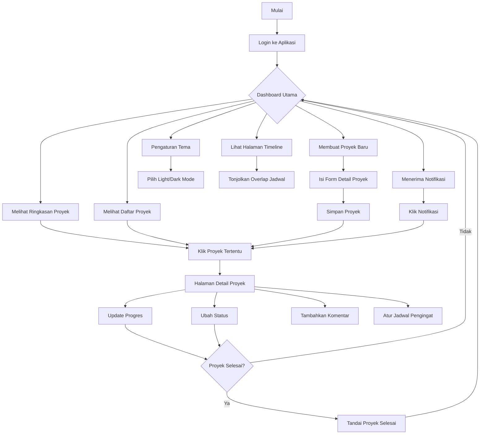
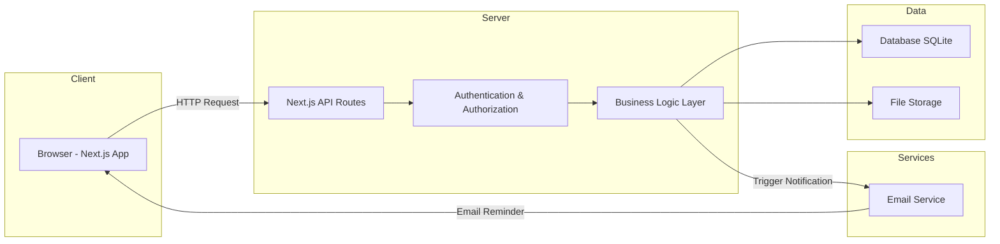
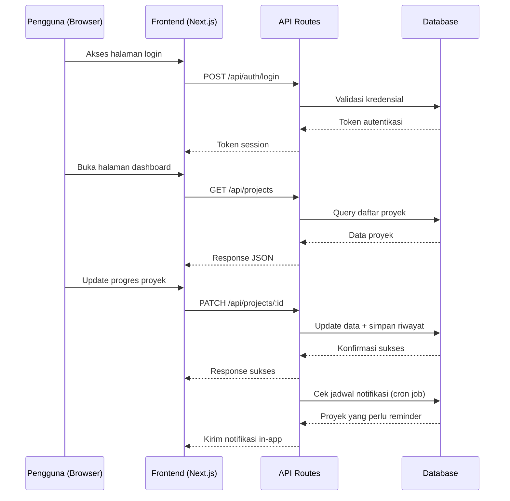

# PRD — Project Requirements Document

## 1. Overview

Divisi Enterprise Jaya Survei Indonesia (JSI) saat ini menghadapi kesulitan dalam memantau perkembangan proyek secara terpusat. Setiap anggota tim mengerjakan proyek yang berbeda, namun informasi status proyek tersebar di berbagai media (chat, email, spreadsheet) sehingga tidak ada satu sumber kebenaran yang jelas.

Aplikasi **Project Tracking Dashboard** hadir untuk menyelesaikan masalah ini dengan menyediakan platform terpusat yang memungkinkan setiap anggota divisi untuk:

- **Mencatat dan memperbarui progres** proyek masing-masing secara real-time
- **Melihat status proyek** seluruh tim dalam satu dashboard
- **Mengetahui prioritas** proyek mana yang harus dikerjakan lebih dulu
- **Menerima notifikasi otomatis** untuk proyek yang membutuhkan perhatian atau follow-up

Tujuan utamanya adalah meningkatkan transparansi, efisiensi koordinasi, dan memastikan proyek prioritas selalu mendapat perhatian yang tepat waktu.

---

## 2. Requirements

### Kebutuhan Fungsional

| Kode | Kebutuhan | Deskripsi |
|------|-----------|-----------|
| F1 | Halaman Login & Autentikasi | Pengguna dapat mengakses halaman login terdedikasi untuk masuk menggunakan email dan password dengan validasi kredensial serta mengakhiri sesi (logout) |
| F2 | Manajemen Profil | Pengguna dapat mengubah informasi profil (nama, foto, dll.) |
| F3 | CRUD Proyek | Pengguna dapat membuat, melihat, mengedit, dan menghapus proyek |
| F4 | Kategori Proyek | Proyek dapat dikategorikan: Penjualan, Jasa, Training, Riset |
| F5 | Level Prioritas | Setiap proyek memiliki prioritas: Tinggi, Sedang, Rendah. Secara default dihitung otomatis dari enam parameter berbobot yang disepakati tim (lihat §3a); bisa dikunci manual per proyek |
| F5b | Ketergantungan Proyek | Satu proyek dapat dicatat menahan proyek lain. Relasi ini menyumbang ke skor prioritas dan tidak boleh melingkar (dua proyek saling menunggu) |
| F6 | Status Proyek | Status mengikuti tahap pipeline: Prospect, Penawaran, Negosiasi, Berjalan, Tertunda, Selesai. Hanya "Selesai" yang dianggap terminal; "Tertunda" tetap dihitung aktif |
| F6b | Identitas & Nilai Klien | Setiap proyek mencatat instansi klien (wajib), nama PIC klien, email, telepon, dan Nilai Kontrak dalam rupiah penuh |
| F6c | Detail Kontrak & Keuangan | Setiap proyek mencatat nomor kontrak, tanggal kontrak, TOP (skema pembayaran: Full / 3 Termin / Custom beserta keterangannya), type tax (PKP / Non PKP), sales fee/kickback, dan cost operasional. Margin/profit **dihitung** dari kelima angka itu, tidak diketik dan tidak disimpan |
| F7 | Pelacakan Progres | Pengguna dapat memperbarui persentase progres dan menambahkan catatan |
| F8 | Riwayat Progres | Sistem mencatat riwayat perubahan progres setiap proyek |
| F9 | Dashboard Ringkasan | Tampilan ringkasan jumlah proyek per status dan prioritas |
| F10 | Filter & Pencarian | Pengguna dapat memfilter proyek berdasarkan status, prioritas, jenis, atau anggota |
| F11 | Notifikasi Pengingat | Pengguna menerima notifikasi untuk proyek yang perlu follow-up |
| F12 | Manajemen Jadwal Pengingat | Pengguna dapat mengatur waktu/jadwal pengingat untuk proyek tertentu |
| F13 | Kolaborasi Tim | Pengguna dapat melihat proyek milik anggota tim lain |
| F14 | Komentar Proyek | Pengguna dapat memberikan komentar/diskusi pada proyek tertentu |
| F15 | Halaman Profil Anggota | Menampilkan detail anggota tim dan daftar proyek yang sedang dikerjakan |
| F16 | Timeline & Alokasi Jadwal | Pengguna dapat melihat visualisasi timeline/Gantt chart proyek yang berjalan dalam rentang waktu yang sama untuk memetakan jadwal overlap dan membagi fokus serta alokasi tim lapangan secara optimal |
| F17 | Pengaturan Tema & Tampilan | Pengguna dapat memilih mode tampilan (Dark Mode / Light Mode) atau preferensi tema warna aksen antarmuka untuk kenyamanan visual, dan preferensi ini tersimpan di sistem/lokal |
| F19 | Tingkat Akses & Peran | Lima tingkat akses (Admin, Owner, HR, Manager, Anggota) di kolom `access_level`, terpisah dari `role` yang berisi jabatan bebas. Navigasi, halaman, dan tombol menyesuaikan peran; penegakannya di server, bukan sekadar menyembunyikan tombol |
| F20 | Kelola Pengguna | Admin dapat menambah akun beserta sandi awal, menyetel ulang sandi, mengubah tingkat akses, dan menonaktifkan akun. Menyetel sandi dan mengubah akses selalu mencabut sesi berjalan |
| F21 | Agenda Tim | Manager dan Anggota mencatat agenda (Lapangan/Kantor/Perjalanan/Cuti) berikut tanggal, lokasi, dan proyek terkait. Manager dapat mengisikan untuk anggotanya. Seluruh peran dapat melihatnya — inilah cara HR tahu siapa sedang di mana |
| F22 | Laporan Mingguan | Ekspor Excel/Word/PDF berisi ringkasan pekan: proyek telat, tenggat 7 hari, selesai pekan ini, agenda tim, dan bentrok PIC. Terbuka untuk semua peran; kolom keuangan menyesuaikan hak masing-masing |
| F18 | Ekspor Data & Timeline | Daftar proyek dan timeline dapat diunduh sebagai Excel (.xlsx), Word (.docx), atau PDF. Ekspor mengikuti filter dan urutan yang sedang tampil di layar; nilainya tetap dibaca ulang di server sehingga berkas tidak pernah memuat angka yang sudah usang |

### Kebutuhan Non-Fungsional

| Kode | Kebutuhan | Deskripsi |
|------|-----------|-----------|
| NF1 | Keamanan | Data hanya dapat diakses oleh pengguna yang terautentikasi |
| NF2 | Responsivitas | Tampilan optimal di desktop, tablet, dan mobile |
| NF3 | Kinerja | Waktu muat halaman dashboard kurang dari 3 detik |
| NF4 | Reliabilitas | Data tidak hilang; backup terjadwal |
| NF5 | Kemudahan Penggunaan | UI sederhana dan intuitif tanpa perlu pelatihan khusus |

---

## 3. Core Features

### Fase 1 — Dashboard & Visibilitas Proyek

| Fitur | Deskripsi |
|-------|-----------|
| **Dashboard Utama** | Halaman ringkasan berisi total proyek, jumlah proyek berjalan, dan proyek selesai dalam satu tampilan |
| **Daftar Proyek** | Tabel/kartu berisi seluruh proyek yang dapat difilter berdasarkan status, prioritas, jenis, dan anggota |
| **Proyek Prioritas** | Proyek dengan prioritas tinggi otomatis disorot dan ditampilkan di bagian paling atas |
| **Timeline Proyek** | Tampilan timeline/Gantt interaktif berbasis rentang tanggal proyek untuk mendeteksi potensi tumpang tindih jadwal (overlapping projects), membutuhkan ketersediaan beban kerja, dan mempermudah distribusi personel/tim lapangan |

### Fase 2 — Manajemen Proyek & Pelacakan Progres

| Fitur | Deskripsi |
|-------|----------------|
| **Tambah Proyek Baru** | Form untuk membuat proyek dengan detail lengkap: nama, deskripsi, jenis, prioritas, tenggat waktu, dan PIC/penanggung jawab |
| **Edit & Hapus Proyek** | Pengguna dapat mengubah informasi proyek atau menghapus proyek yang sudah tidak relevan |
| **Atur Prioritas** | Prioritas dihitung otomatis dan diurutkan di bagian "Fokus Hari Ini"; PIC dapat mengunci nilainya secara manual bila ada pertimbangan khusus |
| **Kelola Jenis Proyek** | Mengatur kategori proyek: Penjualan, Jasa, Training, Riset |
| **Catat Progres** | Memperbarui persentase progres (0-100%) dan menambahkan catatan perkembangan |
| **Riwayat Progres** | Menampilkan log perubahan progres secara kronologis |
| **Ubah Status** | Mengubah tahap proyek: Prospect → Penawaran → Negosiasi → Berjalan → Selesai, dengan Tertunda untuk proyek yang diparkir sementara |

### Fase 3 — Notifikasi & Kolaborasi Tim

| Fitur | Deskripsi |
|-------|----------------|
| **Terima Notifikasi** | Notifikasi muncul untuk proyek yang mendekati tenggat, belum ada progres dalam waktu lama, atau baru ditugaskan |
| **Kirim Pengingat** | Sistem mengirim pengingat otomatis via email/in-app kepada PIC proyek |
| **Atur Jadwal Pengingat** | Pengguna dapat menentukan frekuensi dan waktu pengingat sesuai kebutuhan |
| **Lihat Proyek Anggota** | Menampilkan daftar proyek yang dikerjakan oleh setiap anggota tim |
| **Profil Anggota** | Halaman detail anggota berisi informasi kontak dan proyek yang sedang dikerjakan |
| **Komentar Proyek** | Fitur diskusi pada halaman detail proyek untuk koordinasi antar anggota |

### Fase 4 — Autentikasi & Manajemen Akun

| Fitur | Deskripsi |
|-------|-----------|
| **Halaman Login & Autentikasi** | Halaman login terdedikasi yang aman dengan validasi form, manajemen status sesi, dan proteksi rute halaman |
| **Tema & Kustomisasi Tampilan** | Pengaturan untuk beralih antara tema Terang (Light Mode) dan Gelap (Dark Mode) serta pemilihan palet warna aksen UI yang persisten |
| **Kelola Profil** | Pengguna dapat mengubah nama, foto profil, dan informasi kontak |

---

## 3a. Parameter Prioritas Proyek

Enam parameter hasil kesepakatan tim. Tiap parameter diberi skor **1-5**, lalu
dijumlahkan berbobot menjadi skor akhir **1,00-5,00**. Implementasinya di
`lib/priority.ts`, dan seluruh angka di bawah dikunci oleh `lib/priority.check.ts`.

| Parameter Prioritas | Bobot | Kriteria Skor 5 (Sangat Kritis) | Kriteria Skor 1 (Sangat Aman) |
|---|---|---|---|
| Nilai Proyek (Rp) | 25% | > Rp 500 Juta | < Rp 50 Juta |
| Status Mitra / Klien | 20% | Klien VIP / Tier 1 | Klien Baru / Proyek Internal |
| Risiko Penalti | 15% | Denda harian / Putus Kontrak | Tidak ada penalti |
| Progres Tertinggal | 15% | Tertinggal > 20 Poin | Mendahului Jadwal |
| Tenggat Waktu | 15% | < 7 Hari | > 30 Hari |
| Ketergantungan (Blocker) | 10% | Menahan > 2 Proyek Lain | Tidak berkaitan (Mandiri) |

**Band tengah.** Tabel di atas hanya mendefinisikan ujung-ujungnya; empat band di
antaranya diisi seperti ini:

| Skor | Nilai Proyek | Tenggat | Progres tertinggal | Ketergantungan |
|---|---|---|---|---|
| 5 | > Rp 500 jt | < 7 hari (termasuk lewat) | > 20 poin | menahan > 2 proyek |
| 4 | Rp 250-500 jt | 7-14 hari | 11-20 poin | menahan 2 proyek |
| 3 | Rp 100-250 jt | 15-21 hari | 1-10 poin | menahan 1 proyek |
| 2 | Rp 50-100 jt | 22-30 hari | tepat jadwal | menunggu proyek lain |
| 1 | < Rp 50 jt | > 30 hari | mendahului > 10 poin | mandiri |

Dua parameter memetakan langsung ke skor:

- **Status Mitra / Klien** — VIP 5 · Strategis 4 · Reguler 3 · Baru 2 · Internal 1
- **Risiko Penalti** — Putus kontrak 5 · Denda harian 5 · Denda tetap 4 · Teguran 2 · Tidak ada 1

**Ambang level:** skor >= 3,50 Tinggi · >= 2,50 Sedang · sisanya Rendah.

**Keputusan yang perlu dicatat:**

- Nilai proyek yang **belum diisi** diberi skor 3 (netral), bukan 1 — "belum
  ditentukan" tidak sama dengan "kecil".
- **Tenggat yang sudah lewat** masuk band 5 bersama "< 7 hari"; tabel tim tidak
  memberi band tersendiri untuk keterlambatan. Keterlambatan tetap menonjol lewat
  notifikasi dan parameter progres tertinggal.
- **Proyek Selesai** dikecualikan: skornya 1,00 dan levelnya Rendah.
- **Tahap pipeline** dan **bentrok jadwal PIC** tidak lagi menyumbang skor — keduanya
  di luar enam parameter — tapi tetap dipakai sebagai pemecah seri saat dua proyek
  skornya sama persis.
- **Data keuangan (F6c) sengaja tidak masuk skor.** Margin, sales fee, cost operasional,
  dan status pajak ditampilkan untuk dibaca orang, tapi tidak menggeser urutan.
  Parameter "Nilai Proyek" tetap diukur dari Nilai Kontrak bruto sesuai kesepakatan.
  Kalau suatu saat tim ingin prioritas digerakkan margin, itu keputusan tim — bukan
  perubahan yang boleh masuk diam-diam lewat penambahan kolom.

---

## 3b. Ekspor Berkas

Tiga format, dua cakupan (daftar proyek dan timeline). Berkasnya dibuat di server
lewat **server action**, bukan route handler — alasannya sama dengan `lib/actions.ts`:
route handler punya salinan modul sendiri, jadi berkas yang dibuat di sana akan
memuat data awal, bukan perubahan yang baru disimpan orang lewat form. Ekspor yang
diam-diam basi lebih berbahaya daripada ekspor yang gagal.

| Format | Daftar Proyek | Timeline |
|---|---|---|
| Excel (.xlsx) | Seluruh kolom, angka sebagai angka, baris kepala dibekukan | 3 lembar: jadwal, bentrok jadwal, bentrok PIC |
| Word (.docx) | Tabel kolom inti, halaman bentang | Tabel jadwal + rincian bentrok |
| PDF | Tabel kolom inti, berhalaman, kepala tabel diulang | **Gantt chart** dengan penanda bulan dan legenda prioritas |

**Yang perlu dicatat:**

- **Satu definisi kolom** di `lib/export/dataset.ts` dipakai ketiga format, jadi
  Excel, Word, dan PDF tidak bisa menyajikan angka berbeda untuk proyek yang sama.
  Yang boleh berbeda hanya kolom mana yang dipakai — lembar kerja muat memuat
  semuanya, halaman A4 tidak.
- **Excel menerima angka mentah**, bukan teks berformat. Orang membuka spreadsheet
  justru untuk menjumlah dan membuat pivot; "Rp 505.000.000" sebagai teks
  membatalkan semua itu.
- **Tanggal ditulis ISO** (`YYYY-MM-DD`), bukan `Date` Excel. Mengubahnya jadi
  tanggal sungguhan berarti menyerahkan penafsiran zona waktu ke Excel, dan
  tanggal kontrak yang bergeser sehari jauh lebih merugikan daripada kolom yang
  tidak bisa difilter sebagai tanggal. ISO tetap terurut benar secara teks.
- **Gantt di PDF memakai `barPosition()` dan `monthTicks()` yang sama dengan layar**,
  sehingga grafik cetak tidak bisa bergeser dari grafik di aplikasi.
- Font standar PDF hanya mengenal WinAnsi. Nama proyek datang dari isian orang,
  jadi teksnya dijinakkan lebih dulu (`aman()`) — berkas dengan satu tanda tanya
  jauh lebih baik daripada ekspor yang gagal total.
- Ekspor **mengikuti filter di layar** lewat daftar id, tapi nilainya dibaca ulang
  di server. Kolom yang disembunyikan di tabel **tetap ikut** ke Excel: menyembunyikan
  kolom itu soal ruang layar, bukan soal apa yang mau dibawa keluar.

Pustaka: `write-excel-file` (xlsx), `docx`, `pdf-lib`. Ketiganya murni JavaScript
tanpa dependensi native.

---

## 3c. Matriks Tingkat Akses

Tingkat akses disimpan di kolom `access_level`, **terpisah** dari `role` yang berisi
jabatan bebas ("Project Manager"). Kalau keduanya satu kolom, mengganti jabatan
seseorang akan diam-diam mengganti haknya juga.

| Kemampuan | Admin | Owner | HR | Manager | Anggota |
|---|---|---|---|---|---|
| Daftar proyek + timeline | ✅ | ✅ | ✅ | ✅ | ✅ |
| Overview, detail proyek, tim, notifikasi | ✅ | ✅ | ❌ | ✅ | ✅ |
| Angka keuangan (margin, fee, cost, DPP) | ✅ | ✅ | ❌ | ✅ | ❌ |
| Komentar + kirim pengingat | ✅ | ✅ | ❌ | ✅ | ✅ |
| Ubah proyek apa pun | ✅ | ❌ | ❌ | ✅ | ❌ |
| Ubah proyek yang dipegang sendiri | ✅ | ❌ | ❌ | ✅ | ✅ |
| Buat / hapus proyek, kelola jenis | ✅ | ❌ | ❌ | ✅ | ❌ |
| Kelola pengguna | ✅ | ❌ | ❌ | ❌ | ❌ |
| Ekspor + laporan mingguan | ✅ | ✅ | ✅ | ✅ | ✅ |
| Lihat agenda semua orang | ✅ | ✅ | ✅ | ✅ | ✅ |
| Isi agenda sendiri | ✅ | ❌ | ❌ | ✅ | ✅ |
| Isi agenda orang lain | ✅ | ❌ | ❌ | ✅ | ❌ |

Matriksnya ditulis sekali sebagai fungsi murni di `lib/permissions.ts` dan dikunci
85 assertion di `lib/permissions.check.ts`.

**Penegakan berlapis, dan yang sungguhan ada di server:**

1. **Middleware** — hanya memeriksa bentuk cookie (Edge runtime, tidak bisa baca data).
2. **Halaman** — `requireAbility()` mengalihkan ke halaman yang memang boleh dibuka
   peran itu, bukan menampilkan halaman kosong. HR mendarat di `/proyek`.
3. **Server action** — penjaga sesungguhnya. Menyembunyikan tombol bukan kontrol
   keamanan; server action bisa dipanggil langsung.
4. **Route handler** — sesi + kemampuan di 21 dari 23 endpoint (dua sisanya login
   dan logout, yang memang publik).

**Penyensoran keuangan membuang kolomnya, bukan menimpa nilainya dengan `null`.**
Di sistem ini `null` sudah berarti "belum diisi", jadi menimpanya akan berbohong soal
kelengkapan data. Kolomnya dibuang sebelum berkas ekspor dibentuk dan kuncinya dihapus
dari balasan JSON.

**Catatan penting soal sesi:** `POST /api/auth/login` dan server action `masuk()`
menulis ke penyimpanan sesi yang berbeda — route handler dan halaman punya salinan
modul sendiri-sendiri (lihat catatan di `lib/actions.ts`). Sesi yang dibuat lewat REST
hanya berlaku untuk endpoint REST; sesi dari form login hanya berlaku untuk halaman
dan server action. Aplikasi memakai jalur kedua.

---

## 4. User Flow

### Alur Utama Pengguna (Anggota Divisi Enterprise)



### Detail Langkah Pengguna

1. **Login** — Pengguna masuk menggunakan akun email & password yang terdaftar pada halaman login khusus.
2. **Lihat Dashboard** — Pengguna melihat ringkasan total proyek, proyek berjalan, proyek selesai, dan proyek prioritas tinggi.
3. **Eksplorasi Proyek** — Pengguna dapat memfilter daftar proyek berdasarkan status, prioritas, atau jenis.
4. **Buat Proyek** — Klik tombol "Tambah Proyek", isi form lengkap, lalu simpan.
5. **Update Progres** — Buka detail proyek, perbarui persentase progres, dan tambahkan catatan.
6. **Ubah Status** — Tandai proyek selesai jika pekerjaan telah rampung.
7. **Terima Notifikasi** — Sistem mengirim pengingat saat ada proyek yang mendekati deadline.
8. **Kolaborasi** — Berkomentar pada proyek rekan tim untuk berkoordinasi.
9. **Lihat Timeline** — Membuka halaman timeline/Gantt untuk mendeteksi overlap jadwal dan mengoptimalkan alokasi tim lapangan.
10. **Kelola Tema** — Mengubah preferensi tema (Light/Dark mode) dan warna aksen sesuai kebutuhan visual.
11. **Logout** — Keluar dari aplikasi dengan aman setelah selesai bekerja.

---

## 5. Architecture

### Arsitektur Sistem



### Alur Permintaan Data



---

## 6. Database Schema

### Entity Relationship Diagram

```mermaid
erDiagram
    USERS {
        int id PK
        string email UK
        string password_hash
        string name
        string avatar_url
        string role
        datetime created_at
        datetime updated_at
    }
    
    PROJECTS {
        int id PK
        string name
        text description
        string type
        string status
        string priority
        int progress_pct
        string priority_mode
        string client_org
        string client_name
        string client_email
        string client_phone
        string client_tier
        string penalty_risk
        int value
        string contract_no
        date contract_date
        string payment_term
        string payment_note
        string tax_type
        int sales_fee
        int operational_cost
        date start_date
        date deadline
        int owner_id FK
        datetime created_at
        datetime updated_at
    }
    
    PROGRESS_HISTORY {
        int id PK
        int project_id FK
        int user_id FK
        int progress_pct
        text note
        datetime created_at
    }
    
    REMINDERS {
        int id PK
        int project_id FK
        int user_id FK
        string frequency
        datetime next_reminder_at
        boolean is_active
        datetime created_at
        datetime updated_at
    }

    PROJECT_DEPENDENCIES {
        int blocker_id PK, FK
        int blocked_id PK, FK
        datetime created_at
    }

    USER_PREFERENCES {
        int id PK
        int user_id FK
        string theme_mode  // light/dark
        string accent_color
        datetime updated_at
    }
```

**Keterangan**:  
- `USER_PREFERENCES` digunakan untuk menyimpan preferensi tema dan warna aksen per pengguna.  
- Kolom `start_date` dan `deadline` pada tabel `PROJECTS` diperlukan untuk fitur timeline.  
- Kolom `client_*` menyimpan identitas pemberi kerja; hanya `client_org` yang wajib diisi, sisanya sering belum lengkap saat proyek masih tahap Prospect.  
- Kolom `value` adalah **Nilai Kontrak** dalam rupiah penuh dan boleh `NULL` — artinya angkanya memang belum ada, bukan nol rupiah. Untuk klien PKP, angka ini dianggap **sudah termasuk PPN**.  
- Kolom `contract_*` menyimpan identitas kontrak. `contract_date` sengaja dipisah dari `start_date`: pekerjaan bisa sah dimulai lebih dulu berbekal SPK atau LoI, dan `start_date` tetap milik timeline serta parameter Progres Tertinggal.  
- `payment_term` adalah **skema pembayaran** (`Full`/`3 Termin`/`Custom`), bukan tempo jatuh tempo dalam hari. Skema `Custom` wajib dijelaskan di `payment_note`; kewajiban itu ditegakkan validasi aplikasi, bukan `CHECK`, supaya baris lama yang catatannya kosong tidak ikut ditolak.  
- `tax_type` default `Non PKP` — satu-satunya default yang tidak mengubah angka apa pun. Menebak `PKP` akan memotong sekitar 9,9% dari margin setiap proyek lama tanpa pernah diperiksa orang.  
- `sales_fee` dan `operational_cost` boleh `NULL` (belum diisi), berbeda dari `0` (memang tidak ada biayanya).  
- **Margin/profit tidak dikolomkan.** Ia turunan dari `value`, `tax_type`, `sales_fee`, dan `operational_cost`, dihitung di `lib/finance.ts`: untuk PKP, PPN dikeluarkan dulu (`value ÷ 1,11`) karena PPN adalah titipan negara, bukan pendapatan. Menyimpannya berarti ada dua sumber kebenaran yang akan berselisih begitu salah satu komponennya diubah.  
- Kolom `priority_mode` bernilai `auto` (default) atau `manual`. Pada `auto`, kolom `priority` diisi hasil hitungan saat data dibaca; pada `manual`, nilai yang tersimpan tidak pernah ditimpa sistem.  
- Kolom `client_tier` (`VIP`/`Strategis`/`Reguler`/`Baru`/`Internal`, default `Reguler`) dan `penalty_risk` (`Putus kontrak`/`Denda harian`/`Denda tetap`/`Teguran`/`Tidak ada`, default `Tidak ada`) adalah dua parameter prioritas yang tidak bisa disimpulkan sistem dari data lain — lihat §3a.  
- Tabel `PROJECT_DEPENDENCIES` mencatat relasi "proyek A menahan proyek B", dengan `blocker_id` sebagai penahan. Kunci primernya gabungan kedua kolom (tidak bisa ganda) dan ada `CHECK` yang menolak proyek menahan dirinya sendiri. Lingkaran (A menahan B sekaligus B menahan A) tidak bisa dijaga SQLite, jadi ditolak di lapisan aplikasi sebelum disimpan.  
- Tabel `REMINDERS` menyimpan jadwal notifikasi untuk setiap proyek.

---

## 7. API Endpoint (Rencana)

| Method | Endpoint | Deskripsi |
|--------|----------|-----------|
| POST | `/api/auth/login` | Login pengguna |
| POST | `/api/auth/logout` | Logout pengguna |
| GET | `/api/users/me` | Mendapatkan profil pengguna saat ini |
| PUT | `/api/users/me` | Memperbarui profil pengguna |
| GET | `/api/users/me/preferences` | Mendapatkan preferensi tema/warna pengguna |
| PUT | `/api/users/me/preferences` | Memperbarui preferensi tema/warna pengguna |
| GET | `/api/projects` | Mendapatkan daftar proyek (dengan filter) |
| POST | `/api/projects` | Membuat proyek baru |
| GET | `/api/projects/:id` | Mendapatkan detail proyek |
| PUT | `/api/projects/:id` | Mengubah proyek |
| DELETE | `/api/projects/:id` | Menghapus proyek |
| PATCH | `/api/projects/:id/progress` | Memperbarui progres proyek |
| GET | `/api/projects/:id/history` | Mendapatkan riwayat progres proyek |
| GET | `/api/projects/timeline` | Mendapatkan data proyek untuk timeline/Gantt |
| POST | `/api/projects/:id/comments` | Menambahkan komentar pada proyek |
| GET | `/api/projects/:id/comments` | Mendapatkan komentar proyek |
| POST | `/api/reminders` | Membuat jadwal pengingat |
| PUT | `/api/reminders/:id` | Mengubah jadwal pengingat |
| DELETE | `/api/reminders/:id` | Menghapus jadwal pengingat |
| GET | `/api/users` | Mendapatkan daftar anggota untuk kolaborasi |

---

## 8. Teknologi yang Digunakan

- **Frontend**: Next.js (React) dengan Tailwind CSS
- **Backend**: Next.js API Routes
- **Database**: SQLite dengan ORM Prisma
- **Autentikasi**: JWT (JSON Web Token) / NextAuth
- **Notifikasi Email**: Nodemailer / Email Service
- **Hosting**: Vercel (frontend & serverless function)
- **Styling Tema**: CSS Variables + context/localStorage untuk persistensi tema
- **Pengujian**: Jest (unit test), Playwright (E2E)

---

## 9. Prioritas Pengembangan

1. **Fase 1** — Dashboard, Daftar Proyek, Timeline, Fitur Prioritas
2. **Fase 2** — CRUD Proyek, Progres, Riwayat
3. **Fase 3** — Notifikasi, Komentar, Profil Anggota
4. **Fase 4** — Autentikasi & Manajemen Akun, termasuk tema dan kustomisasi

Catatan: Autentikasi dasar (login sederhana) akan dikembangkan lebih awal untuk memungkinkan pengujian selama pengembangan fase lain.

---

## 10. Kriteria Penerimaan

### Untuk Fitur Timeline Proyek

1. Pengguna dapat mengakses halaman timeline/Gantt dari dashboard utama.
2. Timeline menampilkan semua proyek dalam bentuk bar horizontal sesuai rentang tanggal mulai dan tenggat.
3. Proyek yang saling tumpang tindih (overlap) secara visual terlihat jelas dan diberi warna berbeda.
4. Pengguna dapat memfilter timeline berdasarkan status, prioritas, jenis proyek, atau anggota tertentu.
5. Sistem memberikan indikasi proyek yang memiliki potential bentrok jadwal dengan menampilkan jumlah tumpang tindih dalam periode tertentu.
6. Fitur timeline dapat diakses melalui perangkat desktop, tablet, dan mobile dengan tampilan responsif.

### Fitur Login Halaman & Autentikasi

1. Pengguna dapat mengakses halaman login terdedikasi dengan URL yang jelas.
2. Form login memvalidasi email dan password dengan pesan kesalahan yang informatif.
3. Setelah login berhasil, pengguna diarahkan ke dashboard utama.
4. Sesesi pengguna terjaga dengan baik dan dapat diakhiri melalui tombol logout.
5. Rute yang membutuhkan autentikasi dilindungi dan tidak dapat diakses tanpa token valid.

### Fitur Tema & Kustomisasi Tampilan

1. Pengguna dapat beralih antara tema Terang dan Gelap dari halaman pengaturan profil atau menu utama.
2. Pengguna dapat memilih warna aksen preferensinya yang diterapkan ke seluruh UI (tombol, link, highlight).
3. Preferensi tema dan warna yang dipilih disimpan dan tetap aktif saat pengguna kembali menggunakan aplikasi pada perangkat yang sama.

---

## 11. Catatan Tambahan

- Semua perubahan pada progres proyek harus tercatat dalam `PROGRESS_HISTORY` untuk riwayat audit.
- Notifikasi pengingat dikirim secara otomatis melalui job berjadwal (cron) dan dapat dikonfigurasi oleh masing-masing pengguna.
- Data timeline dihasilkan dari kolom `start_date` dan `deadline` pada tabel `PROJECTS`, dialog kolom tersebut diwajibkan saat membuat proyek.
- Preferensi tema dan warna disimpan pada tabel `USER_PREFERENCES` agar pengguna mendapat pengalaman tampilan yang konsisten.
- Desain UIs mengikuti prinsip minimalis dan fokus pada keterbacaan data–terutama pada tampilan timeline yang mungkin memproses banyak proyek.
- Dukungan untuk mode terang dan gelap membantu kenyamanan visual anggota tim yang bekerja kondisi pencahayaan berbeda.

---

Dengan adanya fitur **Timeline Proyek** pada Fase 1, Divisi Enterprise dapat memetakan beban kerja tim lapangan secara lebih terstruktur dan menghindari penumpukan proyek dalam waktu yang sama. Ditambah dengan **pengaturan tema** dan **halaman login** yang aman, aplikasi ini siap memberikan pengalaman yang nyaman, aman, andal bagi seluruh anggota tim.